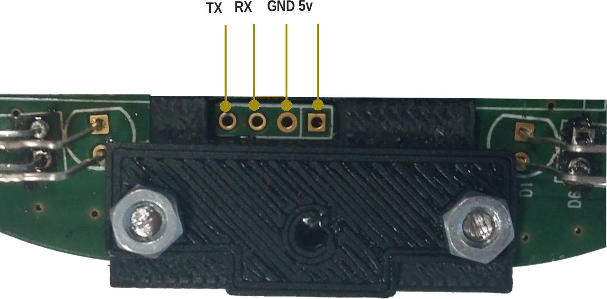
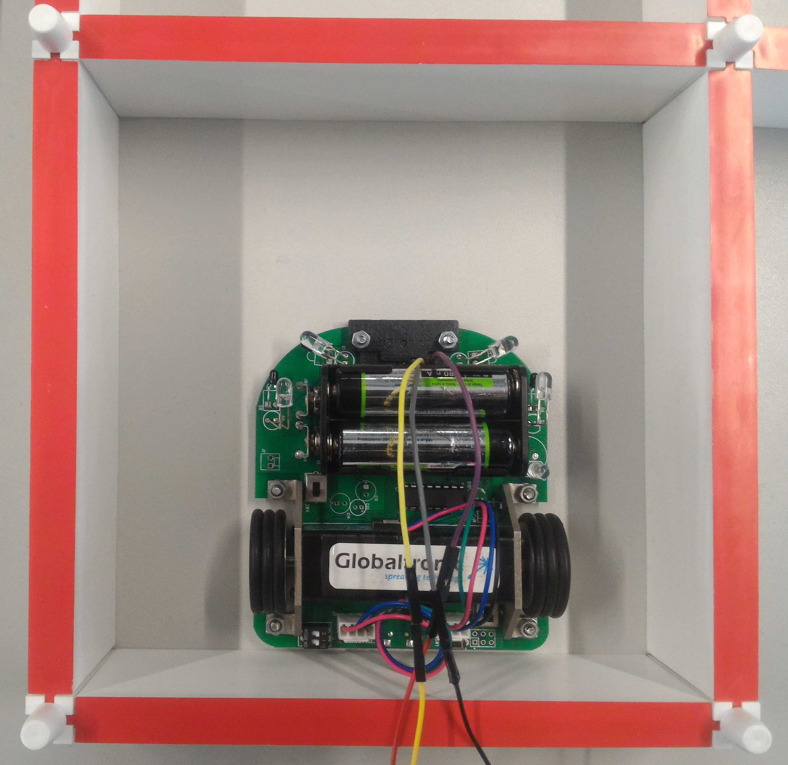

# MMKit-PH

This repository is a fork of [Peter's Harrison code](https://github.com/micromouseonline/ported-micromouse) for the [MMKit](https://www.micromouse.utad.pt/?page_id=998&lang=en). The repository was created to make it easier to run Peter's code using the Arduino IDE, as well as to help in the calibration processes needed to get the micromouse running correctly.

## The Kit

<table>
  <tr>
    <th>Label</th>
    <th>Component</th>
    <th rowspan="17"></th>
    <th>Image</th>
  <tr>
    <td>1</td>
    <td>Left Diagonal IR Sensor</td>
    <td rowspan="16"></td>

  </tr>
  <tr>
    <td>2</td>
    <td>Forward Left IR Sensor</td>
  </tr>
  <tr>
    <td>3</td>
    <td>AA Batteries Support (4 – AA)</td>
  </tr>
  <tr>
    <td>4</td>
    <td>ON/OFF AA Batteries</td>
  </tr>
  <tr>
    <td>5</td>
    <td>Left Stepper Motor</td>
  </tr>
  <tr>
    <td>6</td>
    <td>Configurable Switches for Control Software</td>
  </tr>
  <tr>
    <td>7</td>
    <td>Connector for Right Motor</td>
  </tr>
  <tr>
    <td>8</td>
    <td>Right Diagonal IR Sensor</td>
  </tr>
  <tr>
    <td>9</td>
    <td>Forward Right IR Sensor</td>
  </tr>
  <tr>
    <td>10</td>
    <td>Bluetooth Connector (module not included)</td>
  </tr>
  <tr>
    <td>11</td>
    <td>LED pin 13 / Buzzer (Buzzer not included)</td>
  </tr>
  <tr>
    <td>12</td>
    <td>LED ON/OFF</td>
  </tr>
  <tr>
    <td>13</td>
    <td>Jumper for Selection AA Batteries/LiPo Battery</td>
  </tr>
  <tr>
    <td>14</td>
    <td>Right Stepper Motor</td>
  </tr>
  <tr>
    <td>15</td>
    <td>ON/OFF LiPo Battery (Battery not included)    </td>
  </tr>
  <tr>
    <td>16</td>
    <td>Connector for Left Motor</td>
  </tr>
</table>

## Installation

There's no installation required, to run the code first download its [latest release](https://github.com/micromouse-utad/MMKit-PH/releases/latest). 
After, uncompressed the code in the desired location on your machine and just open the project through the Arduino IDE.

## Serial Connection

Before starting the calibration process of the code for the mouse, it is required to have a Serial connection to the mouse via the Bluetooth Connector ([Label 10](#the-kit)), not necessarily needing to be a Bluetooth adapter, any UART to USB adapter should work in this case.

The MMKit UART connection is as follow:

</img>

To connect to the UART you can use the program [Putty](https://www.chiark.greenend.org.uk/~sgtatham/putty/latest.html), with the baud rate being 57600 or use the Arduino Serial port also using the same baud rate

After the Serial connection is made, you can press 'h' to get the full list of commands available through it.

***NOTE:*** Please take note that this UART connection is only for receiving and transmitting data from/to the MMKit at runtime, you still need to use the USB Connection to upload the sketch.

## Calibration

The calibration consists of 4 parts:
1. Side sensors raw calibration
2. Front sensors raw calibration
3. Front sensors sum/diff calibration
4. Adjust the threshold values

To help with this process a routine was created to help you calibrate the robot, you cal call it if connected through the UART by pressing the key 'c'.

### Side sensors raw calibration

</img> 
The first step in calibrating the raw value of the side sensors is to place the robot in the center of a cell, with a wall in each of the sides.
The side sensors should be in an angle so as to detect the edges of the front wall.

When reading the sensors values, they should be similar in both sides, if not, adjust the sensors so that the read values are as close as possible.

Finally, save the read values in the variables _LD\_CAL_ and _RD\_CAL_, for the Left Diagonal value and Right Diagonal value correspondingly, inside the file _parameters.h_.

&nbsp;
### Front sensors raw calibration

</img>
For the front sensors raw calibration, the steps are similar to before. Start by placing the mouse in a cell with a wall in each of the sides, except, this time, the mouse should be place against the rear wall, instead of centered in the cell.

As before, when reading the sensors values, they should be similar in both sides, requiring an adjustment of the sensors if the values are not alike.

To finalize, the read values must be saved in the variables _LF\_CAL_ and _RF\_CAL_, for the Front Left value and Front Right value correspondingly, inside the file _parameters.h_. 

&nbsp;
### Front sensors sum/diff calibration

</img>
The next step is to calibrate the sum/diffs for the front sensors. To do so, position the mouse against the rear wall, but with the front of the mouse faced to it.

Before continuing, be sure to remove the back wall, as the mouse will move in reverse for this calibration.
 
When the mouse is moving, be sure to not influence its movement, if connected to the UART by cable. If the mouse doesn't moves in a straight line, run the subroutine again.

After the subroutine is finished, save the first array of values in the variable _frontSumTable_, and the second array of values in the variable _frontDiffTable_, inside the file _sensors.cpp_.

***NOTE:*** If the mouse moves forward, instead of backwards, you have the motors connected in the wrong order, and you will need to swap the left with the right motor connection.

### Adjust the threshold values

The final step for the calibration is to adjust the threshold values, for this you can use the command 'S' under the serial port that shows the walls the mouse is currently detecting together with sensor calibrated values. You can change DIAG_THRESHOLD, FRONT_THRESHOLD and FRONT_WALL_INTERFERENCE_THRESHOLD so the mouse sees the walls correctly.

# Usage

To start a new run, position the mouse against the rear wall in the initial cell, make sure that the switch labeled 1 is faced to the right, and move switch 2 left to right, as to simulate a button. After, a red led should be turned on, just occlude the left sensors to start the discovery run.

After the mouse as finished its discovery phase, it will return to the start cell. When he reaches it, don't move the mouse to the rear wall again, only adjust its angle if needed, and occlude the left sensors to start the run to the finish line.
